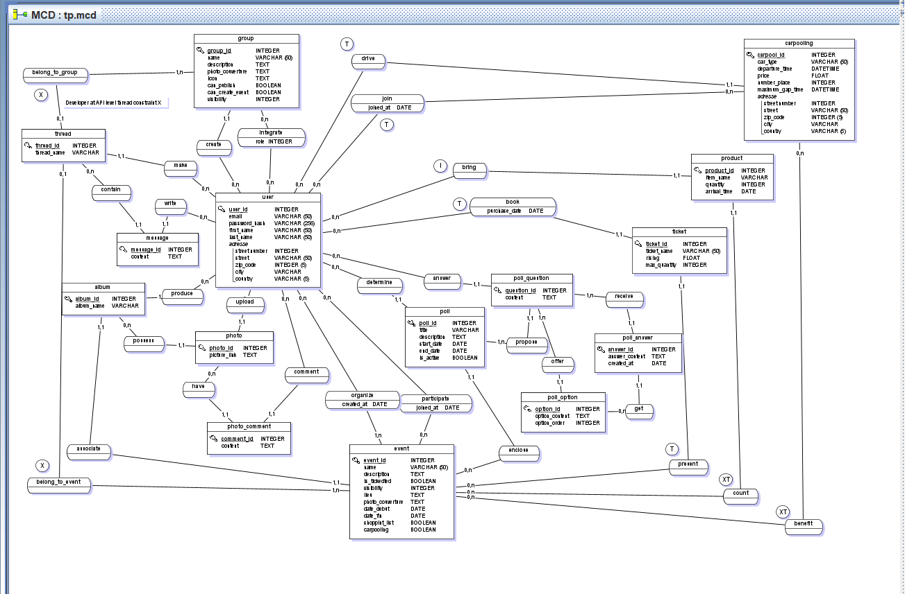

The database is based on the MCD available in the assets folder, you can use JMerise for open it : https://www.jfreesoft.com/JMerise/index.php

The API use the MVC format

The API use this features :

CORS
CSRF TOKEN
PERMISSION RULE
API KEY

🔐 API Key Permissions
SQL Schema for Users and Permissions
CREATE TABLE IF NOT EXISTS users (
id INT AUTO_INCREMENT PRIMARY KEY,
username VARCHAR(100) NOT NULL UNIQUE,
password_hash VARCHAR(255) NOT NULL,
api_key VARCHAR(255) NOT NULL UNIQUE,
role ENUM('admin', 'editor', 'viewer') DEFAULT 'viewer',
permissions JSON DEFAULT NULL,
created_at TIMESTAMP DEFAULT CURRENT_TIMESTAMP
);

-- Example users with roles and permissions
INSERT INTO users (username, password_hash, api_key, role, permissions) VALUES
('admin', SHA2('admin123', 256), 'APIKEY-ADMIN-12345', 'admin', JSON_ARRAY('view_users', 'add_user', 'update_user')),
('editor', SHA2('editor123', 256), 'APIKEY-EDITOR-55555', 'editor', JSON_ARRAY('view_users', 'add_user')),
('viewer', SHA2('viewer123', 256), 'APIKEY-VIEWER-67890', 'viewer', JSON_ARRAY('view_users'));

How Permissions Work
Each API key is associated with a role (admin, editor, viewer).
Each role has a set of permissions stored as a JSON array in the permissions column.
When a request is made, the API checks:
If the X-API-KEY header is present.
If the key exists in the users table.
If the key has the required permission for the requested endpoint.
Example permission check in Python:

def check_permission(api_key, required_permission):
conn = get_db_connection()
cursor = conn.cursor(dictionary=True)
cursor.execute("SELECT permissions FROM users WHERE api_key = %s", (api_key,))
user = cursor.fetchone()
if not user:
return False
permissions = json.loads(user['permissions'])
return required_permission in permissions

1. git clone https://github.com/TheValll/Efrei/tree/main/API/Projet2
2. cd Projet2
3. Create the .env file
   MYSQL_ROOT_PASSWORD=rootpass
   MYSQL_DATABASE=flaskdb
   MYSQL_USER=flaskuser
   MYSQL_PASSWORD=flaskpass
   SECRET_KEY=random_long_stable_string

Remplace the SECRET_KEY by a random long stable string, you can use : https://onlinehashtools.com/generate-random-sha256-hash

4. Create a SSL certificate
   cd api
   & "C:\Program Files\Git\usr\bin\openssl.exe" req -x509 -newkey rsa:4096 -nodes -out cert.pem -keyout key.pem -days 3650

5. Build and start the containers
   cd ..
   docker compose up --build

Flask API → http://localhost:5000
phpMyAdmin → http://localhost:8080
MySQL database → accessible internally as db:3306

6. Go to http://localhost:8080
   Connect you
   Add the SQL file in the database

7. Generate your API token
   curl -H "X-API-KEY: APIKEY-VIEWER-67890" https://127.0.0.1:5000/api/get-token

8. Use the postman in the assets folder
